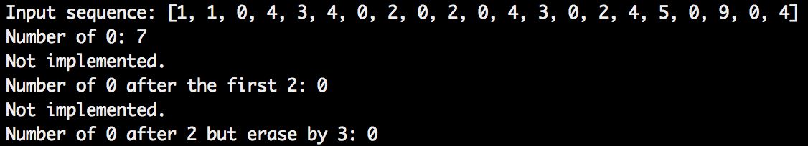
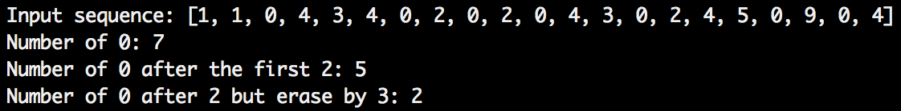

# Project 4 - Recurrent Neural Network (RNN)

- The goal of this project is for you to become familiar with a wildly used RNN unit, Long short-term memory (LSTM)
- This project contains two parts: 1. Design LSTM cells for counting digits in a sequence; 2. Language modeling using RNN with LSTM units.

# Requirements
- Python3
- Numpy
- One of the deep learning frameworks (only required for part 2)

# Dataset
- Part one does not require any dataset.
- Part two: Penn Tree Bank, can be downloaded from [Tomas Mikolov's webpage](http://www.fit.vutbr.cz/~imikolov/rnnlm/simple-examples.tgz).

# Part One Description 
## 1. Objective
- For this part, you need to manually choose the parameters for a LSTM cell to count the digit `0` in a sequence under different criteria. So you do not need to train the model.
- Given a digit sequence, choose three different sets of parameters for a LSTM cell for the following three tasks, respectively:
  1. Count number of all the digit `0` in the sequence;
  2. Count number of `0` after receiving the first `2` in the sequence;
  3. Count number of `0` after receiving the `2` in the sequence, but erase the counts after receiving `3`, then continue to count from 0 after receiving another `2`.
- For example, given the sequence `[1, 1, 0, 4, 3, 4, 0, 2, 0, 2, 0, 4, 3, 0, 2, 4, 5, 0, 9, 0, 4]`, the output for task 1 - 3 should be `7`, `5` and `2`.

## 2. Get the code
- The incomplete code for this part can be found [here](part1/).
- Go to [part1/experiment/](part1/experiment), then run
```
python run.py
```
You will see something like this:


The task 1 is already implemented, and task 2 and 3 are not.

- Read through the code and make sure you understand the entire code. 
- The evaluation scripts can be found [here](part1/experiment/run.py). The input sequence is first encoded into one hot vectors. Then call `count_0_in_seq(input_seq, count_type='task1')` for different tasks by setting `count_type` as `'task1'`, `'task2'` and `task3`. Please do not modify this script to make your results correct.
- The function for counting is defined in [`part1/src/count.py`](part1/src/count.py). For each task, the LSTM cell is first created, and the paramters are assigned by calling functions in [`part1/src/assign.py`](part1/src/assign.py). Then initialize the state for LSTM and count the number of digit `0` by reading the digits one by one iteratively. Taks 1 is already implemented as an example, so you only need to fill the blanks for task 2 and 3. Note the return of this function is `int` which is the counting result.
- LSTM cell is defined in [`part1/src/lstm.py`](part1/src/lstm.py). Two examples of how to assign LSTM parameters can be found in [`part1/src/assign.py`](part1/src/assign.py). Both of them are for task 1. You need to implement other two for task 2 and 3.

## 3. Explaination for task 1.
- There are several suitable parameter sets for the task 1. Here we provide two examples, which can be found in [this script](part1/src/assign.py) (`assign_weight_count_all_0_case_1` and `assign_weight_count_all_0_case_2`). Both cases use 1-dimension internal state. 
- For case 1, the input gate, forget gate and output gate are always on (as value `1`). The input node gets value `1` when receives `0`, and value `0` when receives other digits. Thus, the internal state will be accumulated by 1 every time the input is digit `1`, so as the output.
- For case 2, the input node always gets value `1`, but the input gate only on when receives digit `0` and other two gates are always on. Thus, the output will be the same as case 1.
- To make things easy, I just use large values (`100` or `-100`) to make the sigmoid and hyperbolic functions saturating to get the state and the output value to be 1 or 0, so that I do not need to use any nonlinear activation function for the output of the LSTM cell.

## 4. Implement for task 2 and 3.
- For completing task 2 and 3, you only need to modify [`part1/src/count.py`](part1/src/count.py) and [`part1/src/assign.py`](part1/src/assign.py). 
- You may need to use higher dimensional internal state instead of 1-dimension used in task 1.
- After completing task 2 and task 3 then go to [part1/experiment/](part1/experiment), and run `run.py`. If everything is correct, you will see something like this:


## 5. Submission
- Before submission, make sure you can get the result shown above without modifying `run.py`.
- Put `src` folder in `proj04/part1/`. `src` folder should contain `assign.py`, `count.py` and `lstm.py`.
- When evaluating, I will generate a long sequence and call `count_0_in_seq(input_seq, count_type)` from `count.py`.
- Please do not just use `if` statement for counting.

# Part Two Description 
## 1. Objective
- Design a RNN with LSTM units for language modeling.
- Implement the RNN use one of deep learning frameworks.

## 2. Train the model
- Download PTB dataset from [Tomas Mikolov's webpage](http://www.fit.vutbr.cz/~imikolov/rnnlm/simple-examples.tgz)
- Train the model using `simple-examples/data/ptb.char.train.txt` as training set. 
- Train the model using `simple-examples/data/ptb.train.txt` as training set.
- The text are already tokenized, so you can skip this step if you use this dataset.
- Try to generate text using both trained model.
- You can choose other dataset as training set. But you need to train both character-level and word-level models.

## 3. Submission
- Put code in `proj04/part2/`. 
- Please do not upload data and trained models.


## Deliverable
### Report (Use [this](https://www.ieee.org/conferences/publishing/templates.html) template):
Put report in `proj04/` with `name.csv` containing unityID of your group members.
Write up including figures (but no references) should be no more than 8 pages long.
- Part 1: 
1. Structure of LSTM;
2. Parameters for task 2 and 3;
3. Plot values of input node, internal state, input gate, forget gate and output gate as functions of time step for the example sequence `[1, 1, 0, 4, 3, 4, 0, 2, 0, 2, 0, 4, 3, 0, 2, 4, 5, 0, 9, 0, 4]` for task 2 and 3.
- Part 2:
1. Structure of RNN and hyperparameters you choose for training;
2. Plot perplexity vs training step on both training and validation set for both models (character-level and word-level); 
3. Text generated by each model (Sequence of 100 - 200 words for each is enough). 


### Code
- Put `src` folder for part one in `proj04/part1/`. `src` folder should contain `assign.py`, `count.py` and `lstm.py`.
- Put code for part 2 in `proj04/part2/src`. 
- Select folder `proj04` and zip the folder (as opposed to opening the folder, selecting all contents, then zipping), then submit in Moodle.

## Note
1. Please make sure you can get the result shown in the second figure of part one description without modifying `run.py` before submission. Because I will automatically evaluate your code use a script similar to `run.py`. 
2. Please do not upload data and trained models. 

## Reference
- [Understanding LSTM Networks](http://colah.github.io/posts/2015-08-Understanding-LSTMs/)
- [A Critical Review of Recurrent Neural Networks for Sequence Learning](https://arxiv.org/abs/1506.00019)
- [Visualizing and Understanding Recurrent Networks](https://arxiv.org/abs/1506.02078)
- [The Unreasonable Effectiveness of Recurrent Neural Networks](http://karpathy.github.io/2015/05/21/rnn-effectiveness/)
- [Language modeling a billion words](http://torch.ch/blog/2016/07/25/nce.html)
- [Tensorflow Language Modeling Tutorial](https://www.tensorflow.org/tutorials/sequences/recurrent)
